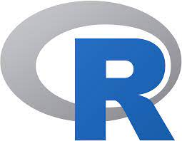

# R-Programming

# Giving support/help

These projects very clearly explain you some of the basics of R programming and briefly covers all major topics for the beginners. These projects are made to help the understanding of the code for beginners that are practicing. If you want to contribute with this little "hobbie project", simply do an issue report about the syntax if there is a mistake, or do a pull request about the new functions.

Thank you!!

Happy coding!!

