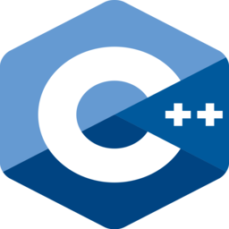

# Programming Languages.

# Giving support/help

These projects very clearly explain you some of the basics for the programming languages, and briefly covers all major topics for the beginners. These projects are made to help the understanding of the code for beginners that are practicing. If you want to contribute with this little "hobbie project", simply do a issue report about the syntax if there's a mistake, or do a pull request about new functions.

Currently working on: C, C++, Python.

Thank you!!

Happy coding!!

   
